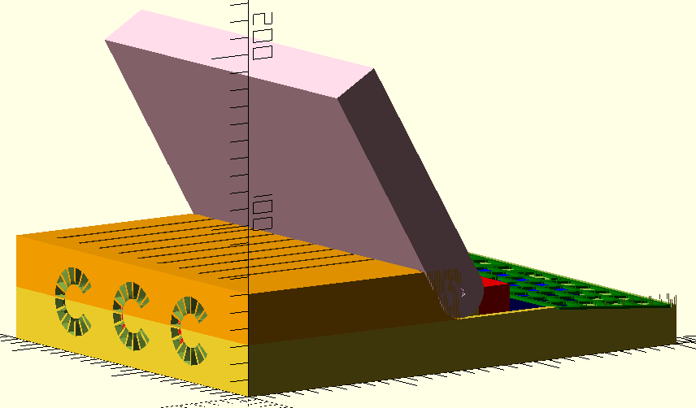

# RAIN PSP

*Redundant Array of Inexpensive Nodes Mark II - Personal Supercomputer Portable (aka: RAIN PSP)*

A "laptop" version of the RAIN Mark II Personal Supercomputer (also known as [RAIN Mark II Supercomputer Trainer](https://hackaday.io/project/85392-rain-mark-ii-supercomputer-trainer)).

This work began years ago as a combination of the [OFFGRiD](https://code.jasongullickson.com/jjg/offgrid) project with ongoing work on the RAIN personal supercomputer.  Unfortunately much of the documentation for the RAIN project has been lost, partially due to problems storing all the files in Github.  As such I'm starting a new repository specific to the RAIN PSP project which will hopefully remain small enough to be managed without errors.

## TODO:

* Control panel cover (between keyboard and bottom of display)
* Improve display hinge
    + Add latch or other form of retention (spring, etc.)
    + Add switch to detect when display is closed
* Openings for ports

# References
* [https://create.arduino.cc/projecthub/ejshea/displaying-key-pressed-on-serial-monitor-98ace1](https://create.arduino.cc/projecthub/ejshea/displaying-key-pressed-on-serial-monitor-98ace1)
