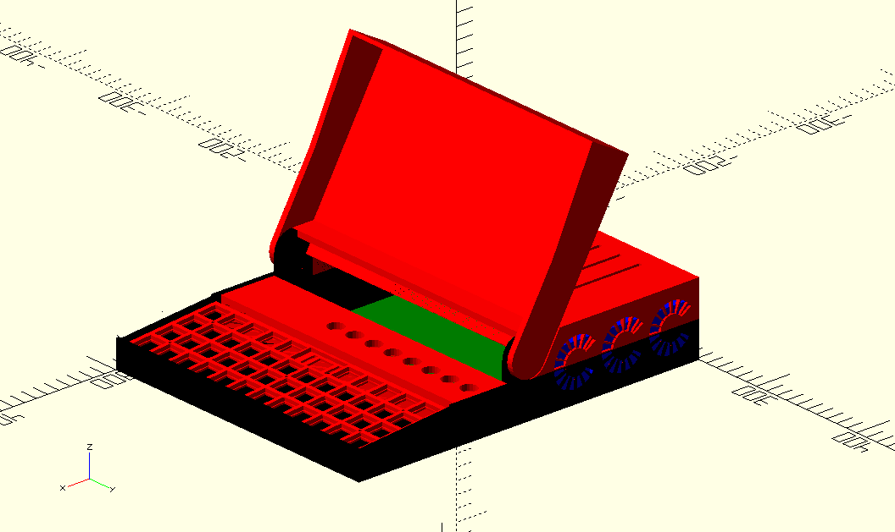

# RAIN PSP

*Redundant Array of Inexpensive Nodes Mark II - Personal Supercomputer Portable (aka: RAIN PSP)*

A "laptop" version of the RAIN Mark II Personal Supercomputer (also known as [RAIN Mark II Supercomputer Trainer](https://hackaday.io/project/85392-rain-mark-ii-supercomputer-trainer)).

This work began years ago as a combination of the [OFFGRiD](https://code.jasongullickson.com/jjg/offgrid) project with ongoing work on the RAIN personal supercomputer.  Unfortunately much of the documentation for the RAIN project has been lost, partially due to problems storing all the files in Github.  As such I'm starting a new repository specific to the RAIN PSP project which will hopefully remain small enough to be managed without errors.

## TODO:

* Software
    * Setup autologin on pi0 and automatically connect serial console
    * Clone SD card for all cluster nodes (setting MAC, IP, etc.)
    * Experiment with network booting
* Keyboard
    * ~~Order remaining keyboard switches~~
    * ~~Select gpio pins for keyboard~~
    * ~~Wire keyboard to pi0 gpio connector~~
    * ~~Wire keyboard switches~~
    * ~~Order final keykcaps~~
    * Design mount for keyboard switchplate once final height is determined
* Display
    * Add LCD to assembly
    * ~~Wire LCD for non-USB power, PWM backlight control~~
    * Relocate LCD now that there's more room on the left side
    * Design display bezel
    * Improve display hinge
        + Add something to provide tension, prevent fasteners from loosening
        + Add latch or other form of retention (spring, etc.)
        + Add switch to detect when display is closed
        + Figure out wire routing
    * Modify display lid, top cover so maximum opening lines-up
* Other
    * ~~Control panel cover (between keyboard and bottom of display)~~
    * ~~Openings for ports~~
    * ~~Connect fans to Clusterboard 20 pin header~~
    * ~~Mount pi0~~
    * ~~Mount Clusterboard~~
    * ~~Test node power switch, LED indicator~~
    * ~~Order power switch/indicators for all cluster nodes~~
    * Add power input jack
    * Add main power switch
    * Expose Clusterboard ethernet port
    * Update renderings
    * Replace PineA64 with pi0 in renderings
    * Move fan mounts up (level with bottom of case)
    * Create retaining strap for fans and remove grooves from case top
    * Add posts for mounting electronics (replace bolts)

# References
* [https://create.arduino.cc/projecthub/ejshea/displaying-key-pressed-on-serial-monitor-98ace1](https://create.arduino.cc/projecthub/ejshea/displaying-key-pressed-on-serial-monitor-98ace1)
* [https://www.thingiverse.com/thing:2822664/files](https://www.thingiverse.com/thing:2822664/files)
* [https://github.com/qmk/qmk_kernel_module](https://github.com/qmk/qmk_kernel_module)
* [https://github.com/torvalds/linux/blob/master/Documentation/devicetree/bindings/input/matrix-keymap.yaml](https://github.com/torvalds/linux/blob/master/Documentation/devicetree/bindings/input/matrix-keymap.yaml)
* [https://github.com/torvalds/linux/blob/master/include/uapi/linux/input-event-codes.h](https://github.com/torvalds/linux/blob/master/include/uapi/linux/input-event-codes.h)
* [https://code.woboq.org/linux/linux/drivers/input/matrix-keymap.c.html](https://code.woboq.org/linux/linux/drivers/input/matrix-keymap.c.html)
* [https://blog.gegg.us/2017/08/a-matrix-keypad-on-a-raspberry-pi-done-right/](https://blog.gegg.us/2017/08/a-matrix-keypad-on-a-raspberry-pi-done-right/)
* [https://pinout.xyz/pinout/pin7](https://pinout.xyz/pinout/)
* [https://elinux.org/RPi_BCM2835_GPIOs](https://elinux.org/RPi_BCM2835_GPIOs)
* [https://www.kernel.org/doc/html/latest/driver-api/input.html](https://www.kernel.org/doc/html/latest/driver-api/input.html)
